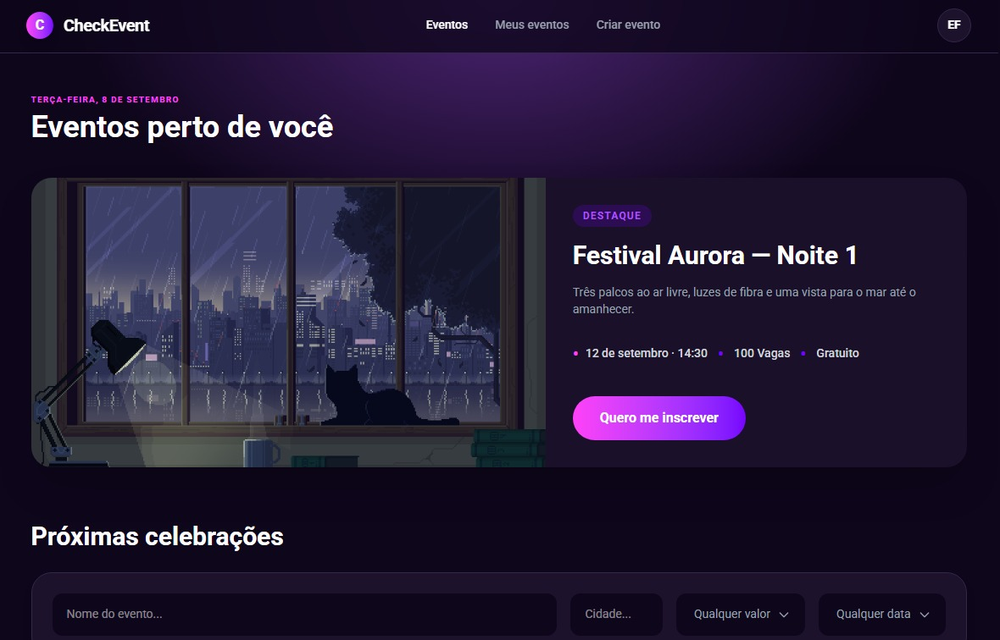
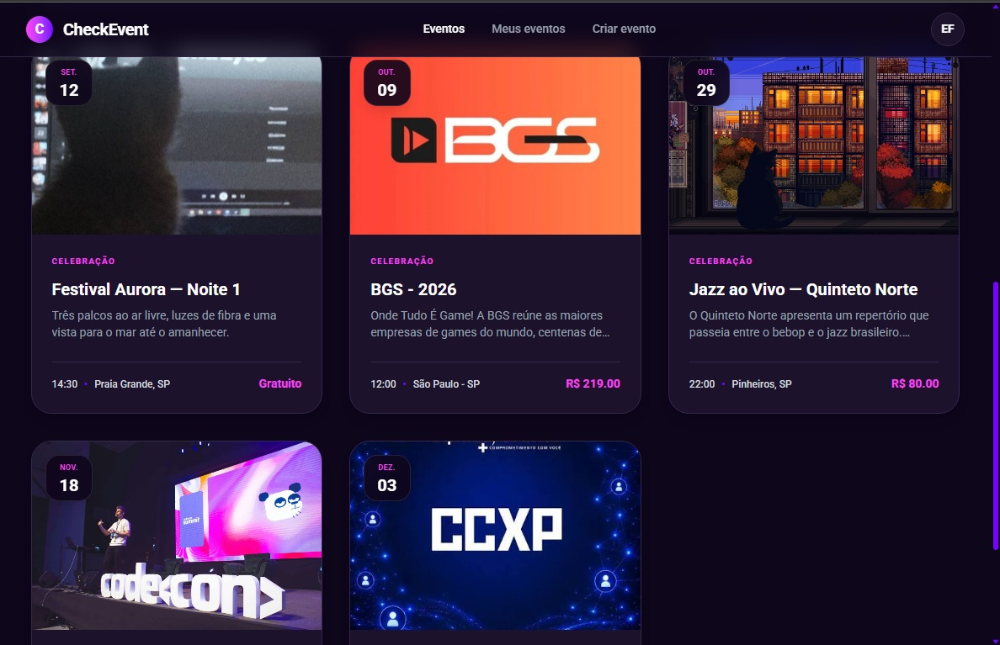
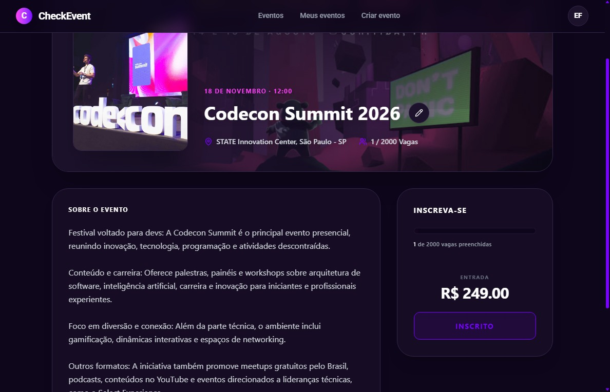
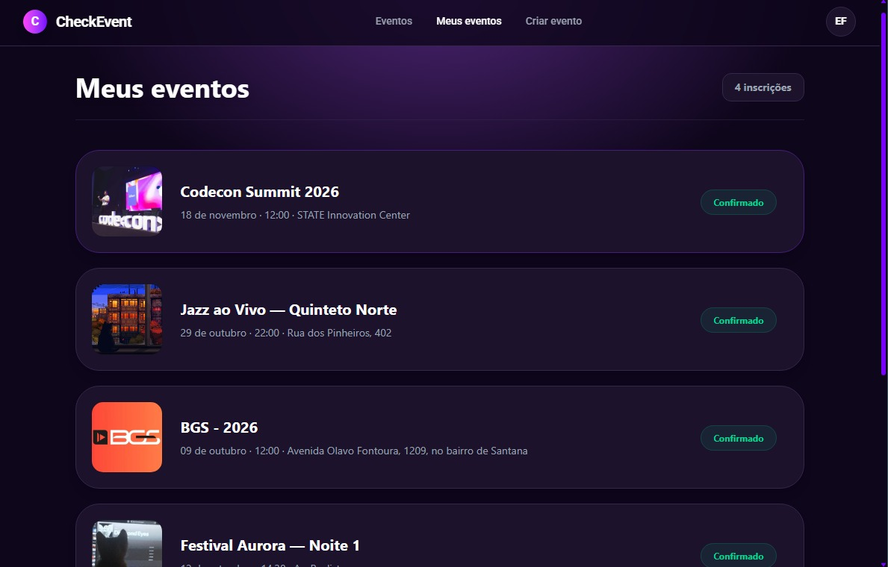
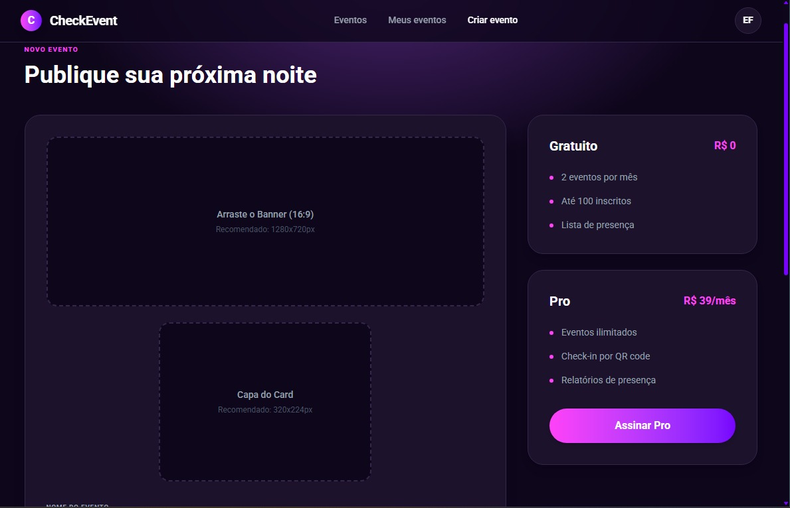
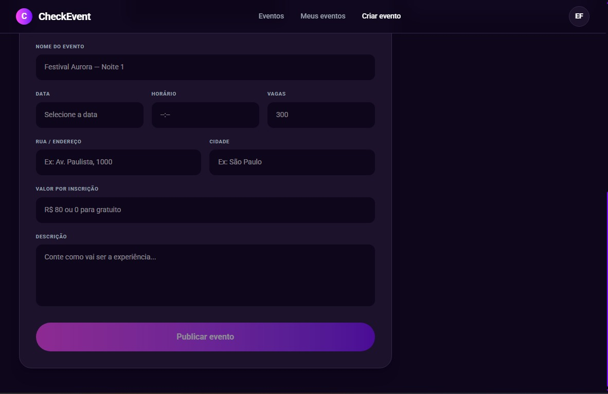

# CheckEvent - RSVP

O projeto é uma plataforma completa para criação, gerenciamento e RSVP (confirmação de presença) em eventos. O sistema conta com uma interface de usuário e um backend robusto baseado em GraphQL.

<br>
<div align="center">
    
</div>
<br>

## 🖥️ Visão Geral do Frontend (Angular)

A interface da aplicação foi construída com **Angular** usando a abordagem de Standalone Components e **Tailwind CSS v4**, focando em uma experiência de usuário premium e alta performance. A aplicação é guiada pelo padrão arquitetural Feature-Sliced Design.

### Padrões e Arquitetura Frontend:
* **Feature-Sliced Design:** Divisão clara entre `core/` (Singletons, Guards, Interceptors), `shared/` (Dumb Components visuais reaproveitáveis) e `features/` (Módulos de negócio como Auth, RSVP e Eventos).
* **Guards & Segurança:** Proteção de rotas garantindo que apenas usuários autenticados acessem a criação e gestão de eventos.
* **HTTP Interceptors:** Injeção automática de tokens Sanctum em requisições e controle centralizado.
* **Design Responsivo:** Layout 100% adaptável construído com **Tailwind CSS v4** (utilizando a diretiva `@theme` para variáveis globais).
* **GraphQL & Reatividade:** Integração eficiente de queries e mutations com o backend usando Apollo, operando de forma assíncrona.

### Galeria de Telas
<table>
  <tr>
    <td width="50%">
      <h3 align="center">Página Inicial (Header)</h3>
      <div align="center">
        
      </div>
    </td>
    <td width="50%">
      <h3 align="center">Lista de Eventos</h3>
      <div align="center">
        
      </div>
    </td>
  </tr>
  <tr>
    <td width="50%">
      <h3 align="center">Detalhes do Evento (RSVP)</h3>
      <div align="center">
        
      </div>
    </td>
    <td width="50%">
      <h3 align="center">Meus Eventos</h3>
      <div align="center">
        
      </div>
    </td>
  </tr>
  <tr>
    <td width="50%">
      <h3 align="center">Criar Evento (Parte 1)</h3>
      <div align="center">
        
      </div>
    </td>
    <td width="50%">
      <h3 align="center">Criar Evento (Parte 2)</h3>
      <div align="center">
        
      </div>
    </td>
  </tr>
</table>

## ⚙️ Arquitetura Técnica do Backend (Laravel + Lighthouse GraphQL)

O backend do projeto foi arquitetado com **Laravel**, seguindo rigidamente os princípios **SOLID**, MVC isolado por Domínio e estruturação de uma API Stateless.

### 1. Comunicação Exclusiva via GraphQL
* Utilização do **Lighthouse GraphQL** com apenas 1 endpoint nativo (`/graphql`).
* Divisão precisa entre Mutations e Queries como camada de entrada; sem lógicas de negócio misturadas nos resolvers.

### 2. Padrões de Projeto e Camadas
* **DTOs (Data Transfer Objects):** Classes `readonly` tipadas que garantem a integridade dos dados transitando entre as Mutations e os Services.
* **Services:** O núcleo das regras de negócio (executam validações, regras de limite de vagas e criptografia Bcrypt).
* **Repositories:** Única camada autorizada a usar o Eloquent ORM ou interagir diretamente com o banco de dados.

### 3. Fila e Cache (RabbitMQ + Redis)
* **Redis:** Utilizado via Docker para store de cache e otimizações.
* **RabbitMQ:** Serviço de mensageria em container para filas de tarefas em background e comunicação.

### 4. Segurança e Autenticação
* Autenticação baseada no **Laravel Sanctum**.
* Geração de Opaque Tokens robustos validados no banco de dados e trafegados no header `Authorization`.
* Tratamentos refinados de segurança diretamente na camada de Mutations/Services.

---

## 🛠️ Tecnologias Utilizadas

### Frontend
* **Angular:** Framework robusto para aplicações web.
* **TypeScript:** Tipagem estática e segurança.
* **Tailwind CSS v4:** Motor utilitário avançado para interface.
* **Apollo GraphQL:** Cliente poderoso para integrações.

### Backend
* **Laravel:** Framework PHP moderno.
* **Lighthouse GraphQL:** Servidor GraphQL fluído para Laravel.
* **MySQL:** Persistência relacional gerenciada via Migrations.

### Infraestrutura
* **Docker:** Orquestração dos containers dos serviços.
* **Redis:** Cache de alta disponibilidade.
* **RabbitMQ:** Serviço de filas (Queueing).

---

## 🚀 Como Executar o Projeto

### Pré-requisitos
* Node.js (v18+)
* PHP 8.2+ e Composer
* Docker e Docker Compose (para Redis e RabbitMQ)
* Banco de dados MySQL

### Passo a Passo

1.  **Clone o repositório:**
    ```bash
    git clone https://github.com/eduardofranco572/CheckEvent
    ```

2.  **Suba os serviços de infra (Redis e RabbitMQ) via Docker:**
    ```bash
    cd backend
    docker-compose up -d
    ```

3.  **Configuração do Backend (Laravel):**
    ```bash
    cd backend
    composer install
    ```
    * Duplique o arquivo `.env.example` para `.env` e configure suas variáveis de ambiente (`DB_CONNECTION=mysql`, credenciais do banco, host do Redis e RabbitMQ).
    * Rode as migrations do banco de dados:
        ```bash
        php artisan migrate
        ```
    * Inicie o servidor Laravel:
        ```bash
        php artisan serve
        ```

4.  **Configuração do Frontend (Angular):**
    Em um novo terminal, acesse a pasta do frontend:
    ```bash
    cd frontend
    npm install
    ```
    * Inicie a aplicação Angular:
        ```bash
         ng serve
        ```

Acesse a interface da aplicação em: `http://localhost:4200` e o painel/API em `http://localhost:8000/graphql`.

---

<br>
<br>

<div align="center" style="display: inline-block">
  <br>
  <p>Tecnologias utilizadas na aplicação</p>

  
  
  
  
  
  
  
  
</div>
<br>

# Desenvolvedor:
- Eduardo Franco Seco (Full-Stack) <br>
  [](https://github.com/eduardofranco572)
  [](https://www.linkedin.com/in/eduardo-franco572/)
